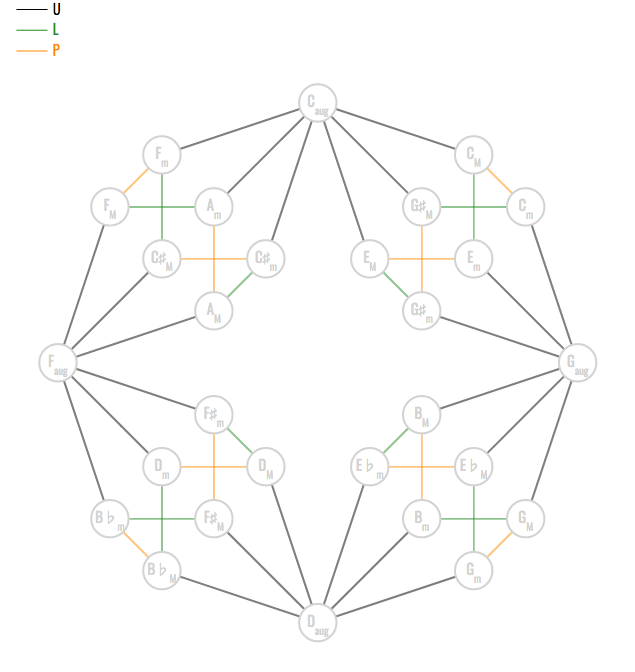

# Web_ColorCubeDance

A web interface for composing (with) automorphisms in the 'colored Cube Dance'.

Try the web interface [here !](https://alexpof.github.io/Web_ColoredCubeDance/)
Don't forget to check the help to familiarize yourself with the interface.

# What is it about ?

The 'Colored Cube Dance' (shown below) is an algebraic extension of Douthett's and Steinbach's Cube Dance graph (see Douthett, J., Steinbach, P. “Parsimonious Graphs: A Study in Parsimony, Contextual Transformations, and Modes of Limited Transposition.” Journal of Music Theory, Vol. 42-2 (1998), pp. 241–263 for more information)

The original parsimonious relation between major, minor, and augmented triads introduced by Douthett and Steinbach is refined using three different binary relations named U, P, and L. This defines a monoid and a corresponding action on this set of triads.

We compute the full automorphism group of this corresponding action, and show that it is isomorphic to , a group of order 7776. More information is given in our preprint published on ArXiV [https://arxiv.org/abs/2204.03022](https://arxiv.org/abs/2204.03022).

This group provides a way to transform chord progressions *via* automorphisms, but its size and complexity does not make it very user-friendly. Therefore, we provide a web interface for manipulating such automorphisms. This allows mathematicians, musicians, and composers to define chord progressions and automatically transform them using these automorphisms and their successive composition (in the sense of group composition). Check out the web interface in the link above !
